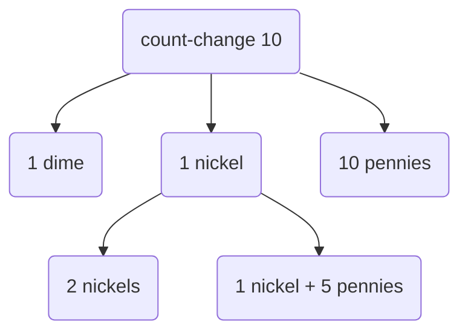

## 1.1 Elements of Programming
- primitive expressions
- means of combination
- means of abstraction

### 1.1.2 Naming and the environment
```scheme
(define (ds expression)
  (display expression)
  (newline))
```

```scheme
(define size 2)
; (display size)
; (newline)
; (display (* 5 size))
; (newline)

; the memory of name -> value mappings is called the _global environment_
```

### 1.1.3 Evaluating Combinations


```scheme
(define (square x) (* x x))
; (define (<name> <formal paramaters>) <body>)
; (display (square 21))
; (newline)
; (display (square (+ 2 5)))
; (newline)
; (display (square (square 3)))
; (newline)
;
(define (sum-of-squares x y)
  (+ (square x) (square y)))
; (ds (sum-of-squares 3 4))
(define (f a)
  (sum-of-squares (+ a 1) (* a 2)))
; (ds (f 5))
```

### 1.1.4 Compound Procedures

### 1.1.5 Substitution Model for Procedure Application

**Applicative order versus normal order

Applicative Order "evaluates arguments then applies" where Normal Order "fully expands then reduces"

Applicative Order

```
(define (square a) (* a a))
(square (+ (+ 1 2) (- 3 1)))
(square (+ 3 2))
(square 5)
(* 5 5)
25
```

Normal Order

```
(square (+ (+ 1 2) (- 3 1)))
(* (+ (+ 1 2) (- 3 1)) (+ (+ 1 2) (- 3 1)))
(* (+ 3 2) (+ 3 2))
(* 5 5)
```

^ Normal order duplicates function calls

### 1.1.6 Conditional Expressions and Predicates
```
(define (abs x)
  (cond ((> x 0) x)
        ((= x0) 0)
        ((< x 0) (- x))))
; (cond (<predicate clause> <consequent expression>))
; better?
(define (abs x)
  (cond ((< x 0) (- x))
        (else x)))
; even better?
(define (abs x)
  (if (< x 0) ; predicate
      (- x) ; consequent
      x)) ; alternative
```

**logical composition operations**
These are special forms, not procedures
because sub expressions are not necessaily all evaluated
```
; (and e1 ... en)
; (or e1 ... en)
```

 Not is a procedure
 ```
(not e)
(ds 
   ((lambda (x) 
     (and (> x 5) (< x 10)))
    6))
(define (>= x y)
  (or (> x y) (= x y)))
; (ds (>= 5 5))
; better?
(define (>= x y)
  (not (< x y)))
; (ds (>= 5 5))
```

#### ex 1.5

 because this procedure is evaluted with applicative-order,
 --that is each operand is evalutated first, then the operator
 the evaluation never terminates
 as (p) keeps expanding to (p)

 ```
; (define (p) (p))
; (define (test x y)
;   (if (= x 0)
;     0
;     y))
```


### 1.1.7 Newtons method
```
(define (sqrt-iter guess x)
  (if (good-enough? guess x) ;wishful
    guess
    (sqrt-iter (improve guess x) ;thinking
               x)))

(define (average x y)
  (/ (+ x y) 2.0))

(define (improve guess x)
  (average guess (/ x guess)))

(define (good-enough? guess x)
  (< (abs (- (square guess) x)) 0.001)) ; set our equivalence tolerant

(define (sqrt x)
  (sqrt-iter 1.0 x)) ; start the program with 1 as guess
;; not perfect
; (ds (square (sqrt 1000)))
```

#### ex 1.6
let's define a new if
```
(define (new-if predicate then-clause else-clause)
  (display "predicate: ")
  (ds predicate)
  (cond (predicate then-clause)
        (else else-clause)))
```


## 1.2 Procedures and the processes they generate

a linear recursive process for computing 6!
```
(define (factorial n)
  (if (= 1 n)
    1
    (* n (factorial n-1))))
```

here's the iterative version, even though it is recursively defined
```
(define (factorial n)
  (fact-iter 1 1 n))
```

ah, now we can save a count
```
(define (fact-iter product counter max-count)
  (if (> counter max-count)
    product
    (fact-iter (* counter product)
               (+ counter 1)
               max-count)))

(ds (= (factorial 3) 6))
```

 in general, iterative process is one whose state can be  summarized by a fixed number of state variables

tail recursion will allow us to make recursive iterations in constant space

**ITERATION vs RECURSION**
iteration a system that has all of its state in explicit variables
```
(define (-1+ x)
  (- x 1))
(define (1+ x)
  (+ x 1))

; iterative
(define (sumitr x y)
  (if (= x 0)
    y
    (sumitr (-1+ x) (1+ y))))
;; this has a time complexity O(x)
;; this has a space complexity O(1)
```

linear recursion 
```
(define (sumrec x y)
  (if (= x 0)
    y
    (1+ (+ (-1+ x) y))))
; this has a time complexity of O(x)
; but has a space complexity of O(x)
; proportional to the input argument in time and space
```

### 1.2.2 Tree Recursion
related: [[Data Structures#Trees]]

Fibonacci numbers are `fib(n) = fib(n - 1) + fib(n - 2)`, except for `fib(0) = 0 and fib(1) = 1`


Recursive Fibonacci definition creates a tree structure
```
(define (fib n)
    (cond ((= n 0) 0)
          ((= n 1) 1)
          (else (+ (fib (- n 1))
                   (fib (- n 2))))))
(equal? (fib 5) 5)
```
But is `O(n^2)` expenentially complex

We can do an procedural example
```
(define (fib-iter a b count)
  (if (= count 0)
      b
      (fib-iter (+ a b) a (- count 1))))
(define (fib n)
  (fib-iter 1 0 n))
(equal? (fib 5) 5)
```

This is O(n) complexity. Recusion is useful on hirearchical data more than numeric computation.

**Example: Counting change**

Count the leaves to determine the ways to make change


A tree recursive algo for counting change:

```
(define (first-denomination kinds-of-coins)
  (cond ((= kinds-of-coins 1) 1)
        ((= kinds-of-coins 2) 5)
        ((= kinds-of-coins 3) 10)
        ((= kinds-of-coins 4) 25)
        ((= kinds-of-coins 5) 50)))

(define (cc amount kinds-of-coins)
  (cond ((= amount 0) 1)
        ((or (< amount 0) (= kinds-of-coins 0)) 0)
        (else (+ (cc amount
                     (- kinds-of-coins 1))
                 (cc (- amount
                        (first-denomination kinds-of-coins))
                     kinds-of-coins)))))

(define (count-change amount)
  (cc amount 5))
(count-change 10)
```

This recursive solution is still not as efficient as an iterative approach, but refactoring might obscure the intention of the algorithm. Smart compilers can optimize these recursive procedures. One way is to `memoize` the procedure calls so that redundant calls to `f(n)` use the cached value of the first call.


### 1.2.5
Greatest Common Divisor using [[Euclid's Algorithm]]

```scheme
(define (gcd a b)
    (if (= b 0)
        a
        (gcd b (remainder a b))))
```
`remainder` is a build in Scheme producre that returns the remainder of args (/ a b)

- fibonacci
- Amount of space taken by recursive algos is
- the proportional to the length of the longest path
- towers of Hanoi

## 1.3 Formulating Abstractions with Higher-Order Procedures
TODO: watch [lecture](https://ocw.mit.edu/courses/electrical-engineering-and-computer-science/6-001-structure-and-interpretation-of-computer-programs-spring-2005/video-lectures/2a-higher-order-procedures)

**lambda**

**let**
