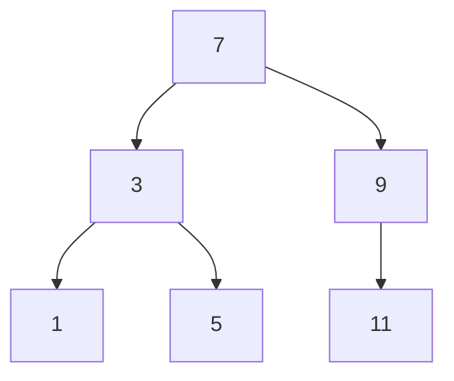
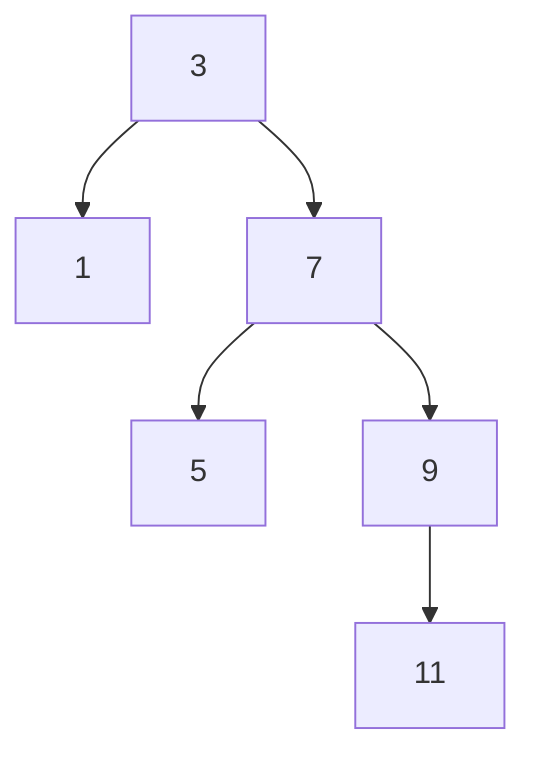
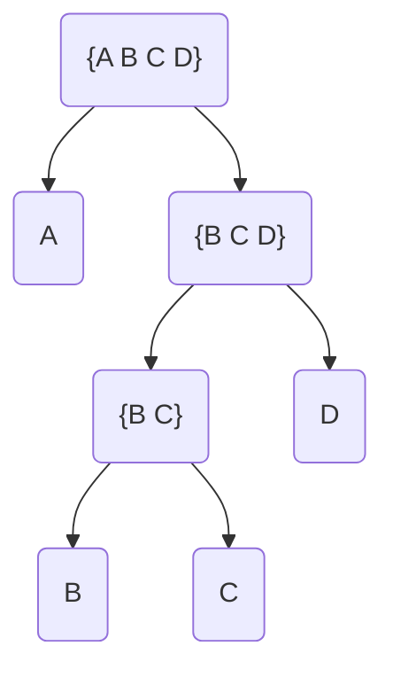
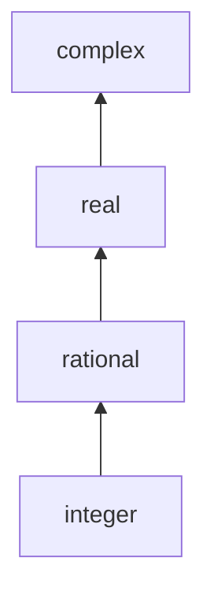

# Building Abstractions with Data

Making compound data. Making functions that can operate on data


Let's create a [[Linear Combination]]

```scheme
(define (linear-combination a b x y)
  (+ (* a x) (* b y)))
```
That works for real numbers, but not rational or complex numbers. We'd rather have something more general

```scheme
(define (linear-combination a b x y)
  (add (mul a x) (mul b y)))
```
Where `add` and `mul` can operate on different operands

## 2.1 Rational Numbers


we'd like something like this:

```scheme
(define (+rat x y)
  (make-rat (+ (* (numer x) (denom y))
               (* (decom x) (numer y)))
            (* (denom x) (denom y))))

(define (-rat x y)
  (make-rat (- (* (numer x) (denom y))
               (* (decom x) (numer y)))
            (* (denom x) (denom y))))

(define (*rat x y)
  (make-rat (* (numer x) (numer y))
            (* (denom x) (denom y))))

(define (/rat x y)
  (make-rat (* (numer x) (denom y))
            (* (denom x) (numer y))))

(define (=rat x y)
  (= (* (numer x) (decom y))
     (* (numer y) (decom x))))
```

To make `make-rat`, we'll need `cons`

```scheme
(define (make-rat n d) (cons n d))
(define (numer x) (car x))
(define (denom x) (cdr x))

(define (print-rat x)
  (newline)
  (display (numer x))
  (display "/")
  (display (denom x)))

(print-rat (make-rat 1 2))
```

To reduce rational numbers to lowest terms, we'll need a `gcd` procedure to find greatest common divisor. We build one in [[SICP - Ch 1]]
```scheme
(define (gcd a b)
    (if (= b 0)
        a
        (gcd b (remainder a b))))
(define (make-rat n d)
  (let ((g (gcd n d)))
    (cons (/ n g) (/ d g))))
(make-rat 3 9)
```

### 2.1.3 What is Meant by Data?

Its taken for granted that we have `cons`, `car` and `cdr`, but what if we didn't?

```scheme
(define (cons x y)
  (define (dispatch m)
    (cond ((= m 0) x)
          ((= m 1) y)
          (else (error "arg not 0 or 1 -- CONS" m))))
  dispatch)

(define (car z) (z 0))
(define (cdr z) (z 1))

(display (car (cons 5 10)))
(display (cdr (cons 5 10)))
```

another way to do it
```scheme
(define (cons x y)
  ; return a function that will take another function 
  ; and apply to x and y
  (lambda (m) (m x y)))

(define (car z)
  ; call function z
  (z 
    ; with a function that returns the first of 2 args
    (lambda (p q) p)))

(define (cdr z)
  (z (lambda (p q) q)))

(car (cons 4 8))
(cdr (cons 4 8))
```
^^ related to [[Church Numerals]] and [[Lambda Calculus]]

### 2.1.4 Interval arithmetic

```scheme
(define (make-interval a b) (cons a b))
(define (lower-bound interval) (car interval))
(define (upper-bound interval) (cdr interval))
(= (lower-bound (make-interval 10 20)) 10)
(= (upper-bound (make-interval 10 20)) 20)

(define (add-interval x y)
  (make-interval (+ (lower-bound x) (lower-bound y))
                 (+ (upper-bound x) (upper-bound y))))
(equal? (add-interval (make-interval 1 2) (make-interval 1 2))
        (make-interval 2 4))

(define (mul-interval x y)
  (let ((p1 (* (lower-bound x) (lower-bound y)))
        (p2 (* (lower-bound x) (upper-bound y)))
        (p3 (* (upper-bound x) (lower-bound y)))
        (p4 (* (upper-bound x) (upper-bound y)))
        )
    (make-interval (min p1 p2 p3 p4)
                   (max p1 p2 p3 p4))))

(equal? (mul-interval (make-interval 1 2) (make-interval 1 2))
        (make-interval 1 4))

(define (div-interval x y)
  (mul-interval x
                (make-interval (/ 1.0 (upper-bound y))
                               (/ 1.0 (lower-bound Y)))))
(equal? (div-interval (make-interval 1 2) (make-interval 1 2))
        (make-interval 0.5 2.0))
```

![[SICP Lectures#Lecture 2B Compound Data]]

## 2.2 - Hierarchical Data and the [[Closure]] Property

scheme `(list a b c)` is equivalent to `(cons a (cons b (cons c)))`

```scheme
(define (length items)
  (define (length-iter a count)
    (if (null? a)
        count
        (length-iter (cdr a) (+ 1 count))))
  (length-iter items 0))
(equal? 4 (length (list 1 2 3 4)))
```

#### ex 2.17

```scheme
(define (last-pair ls)
  (if (null? (cdr ls))
      ls
      (last-pair (cdr ls))))
(equal? (last-pair (list 1 2 3))
         '(3))
```

#### ex 2.18

```scheme
(define (reverse ls)
  (if (null? (cdr ls))
      ls
      (append (reverse (cdr ls)) (list (car ls)))))
(equal? (reverse '(1 2 3)) '(3 2 1))

; appending item to list is different than list to list
(equal? (append '(1 2) '(3)) (append '(1 2) 3))
; which sucks honesly but whatever
```

#### ex 2.19

call back to change counting in [[SICP - Ch 1#1.2.2]]

instead of definining `cc` with US coin demoninations baked in, `cc` should take a list of denominations

```scheme
(define (no-more? coin-values)
  (null? coin-values))
(equal? #t (no-more? '()))
(equal? #f (no-more? '(1)))

(define (except-first-denomination coin-values)
  (cdr coin-values))
(equal? (except-first-denomination '(10 5 1))
        '(5 1))

(define (first-denomination coin-values)
  (car coin-values))
(equal? (first-denomination '(10 5 1))
        10)

(define (cc amount coin-values)
  (cond ((= amount 0) 1)
        ((or (< amount 0) (no-more? coin-values)) 0)
        (else
         (+ (cc amount
                (except-first-denomination coin-value))
            (cc (- amount
                   (first-denomination coin-values))
                coin-values)))))
(equal? (cc 10 '(10 5 1)) 4)
(equal? (cc 10 '(10 5 2 1 0.5)) 50)
(define us-coins '(50 10 1 25 5)) ; note that order doesn't affect output
(equal? (cc 100 us-coins) 292)
(define uk-coins '(100 50 20 10 5 2 1 0.5))
(equal? (cc 100 uk-coins) 104561) ; totally insane
```

**map** defined recusrively

### 2.2.2 Hierarchical Structures

**trees**

```scheme
(define nil '())
(define (scale-tree node factor)
  (cond ((null? node) nil)
        ((not (pair? node)) (* node factor))
        (else (cons (scale-tree (car node) factor)
                    (scale-tree (cdr node) factor)))))
(scale-tree (list 1 (list 2 (list 3 4) 5) (list 6 7))
            10)
```

let's use `map`

```scheme
(define (scale-tree tree factor)
  (map (lambda (node)
         (if (pair? node)
             (scale-tree node factor)
             (* node factor)))
       tree))
(scale-tree (list 1 2 3) 2)
(scale-tree (list 1 (list 2 3) (list 4 5 (list 6))) 2)
```

#### ex 2.31

define `tree-map`

```scheme
(define (tree-map fn tree)
  (map (lambda (node)
         (if (pair? node)
             (tree-map fn node)
             (fn node)))
       tree))
(tree-map (lambda (x) (* x x)) (list 1 (list 2 3 (list 4))))
```

### 2.2.3 Sequences as Conventional Interfaces

**Sequence Operations**

explains **filter**

### 2.2.4 Example: A Picture Language
*Not in my textbook*

**Levels of language for robust design**

stresses importance of stratified design

![[SICP Lectures#Lecture 3A]]

# 2.3 Symbolic Data

### 2.3.1
*2.2.3 in book*
introduces **quote**

```scheme
(car '(a b c))
; a
```

`eq` tests whether two symbols are the same

```scheme
(eq? 'a 'a)
(eq? '() '())
; for some reason not quoted lists of quoted symbols
(eq? '('a) '('a)) ; #f
```

```scheme
(define (memq item x)
  (cond ((null? x) false)
        ((eq? item (car x)) x)
        (else (memq item (cdr x)))))
(memq 'apple '(x (apple sauce) y apple pear))
; #t
```

#### ex 2.53

```scheme
(list a b c)
; ERROR
(list 'a 'b 'c)
; (a b c)
(list (list 'george))
; ((george))
```

#### ex 2.55

```scheme
(car ''abracadabra)
; quote
; because ''n => (quote (quote n)) => '(quote n)
```

list euality - two lists are `equal?` if they contain the same elements in the same order

```scheme
(equal? '('a 'b) '('a 'b))
```

```scheme
; wierd
(car ''abc)
(cdr ''abc)
```


### 2.3.2 Example: Symbolic Differentation
*2.2.4 in book*
[ ] TODO: watch [lecture](https://ocw.mit.edu/courses/electrical-engineering-and-computer-science/6-001-structure-and-interpretation-of-computer-programs-spring-2005/video-lectures/3b-symbolic-differentiation-quotation/)

finding [[derivative - math]]

make a procedure that takes as arguments an algebraic expression and a variable and return the derivative of the expression with respect to the variable.

For `ax^2 + bx + c` and var `x`, the procedure should return `2ax + b`

We'll create abstract data types first, then handle interpreting the expressions

*skipping over actually understanding [[differential equation\|differentation]] right now*

We'll need some `selectors`, `constructors` and `predicates` to interpret expressions.

We're aiming to build this `deriv` procedure:

```scheme
(define (deriv exp var)
  (cond ((number? exp) 0)
        ((variable? exp)
         (if (same-variable? exp var) 1 0))
        ((sum? exp)
         (make-sum (deriv (addend exp) var)
                   (deriv (augend exp) var)))
        ((product? exp)
         (make-sum
          (make-product (multiplier exp)
                        (deriv (multiplicand exp) var))
          (make-product (deriv (multiplier exp) var)
                        (multiplicand exp))))
        (else
         (error "unkown expression type -- DERIV" exp))))
```

#### Representing algebraic expressions

We can express these equations using lisp syntax, ie `ax + b` is `(+ (* a x) b)`

The variables are symbols, we can check them using the built in `symbol?` predicate.
Two variables are the same if the symbol representing them is the same.

```scheme
(define (variable? x) (symbol? x))
(define (same-variable? v1 v2)
  (and (variable? v1) (variable? v2) (eq? v1 v2)))
```

Sums and products are constructed as lists:

```scheme
(define (make-sum a1 a2) (list '+ a1 a2))
(define (make-product m1 m2) (list '* m1 m2))
```

Sum is a list whose first element is the symbol `+`:

```scheme
(define (sum? x)
  (and (pair? x) (eq? (car x) '+)))
```

The addend is the second itemof the sum list:

```scheme
(define (addend s) (cadr s))
```

The augend is the third item of the sum list

```
(define (augend s) (caddr s))
```

```scheme
(define (product? x)
  (and (pair? x) (eq? (car x) '*)))
(define (multiplier p) (cadr p))
(define (multiplicand p) (caddr p))
```

Let's try it
```
(deriv '(+ x 3) 'x)
=>(+ 1 0)
(deriv '(* x y) 'x)
=>(+ (* x 0) (* 1 y))
```

In order to simplify answers, we refactor `make-sum`

```scheme
(define (=number? exp num)
  (and (number? exp) (= exp num)))
(define (make-sum a1 a2)
  (cond ((=number? a1 0) a2)
        ((=number? a2 0) a1)
        ((and (number? a1) (number? a2)) (+ a1 a2))
        (else (list '+ a1 a2))))
(define (make-product m1 m2)
  (cond ((or (=number? m1 0) (=number? m2 0)) 0)
        ((=number? m1 1) m2)
        ((=number? m2 1) m1)
        ((and (number? m1) (number? m2)) (* m1 m2))
        (else (list '* m1 m2))))
```

```
(deriv '(+ x 3) 'x)
=>1
(deriv '(* x y) 'x)
=>y
(deriv '(* (* x y) (+ x 3)) 'x)
=>
```

![[SICP Lectures#Lecture 3B - Symbolic Differentation]]

### 2.3.3 Example: Representing Sets

```scheme
(define (element-of-set? x set)
  (cond ((null? set) false)
        ((equal? x (car set)) true)
        (else (element-of-set? x (cdr set)))))
(element-of-set? 1 '(3 2 1))
(element-of-set? 'a '(3 2 1))

(define (adjoin-set x set)
  (if (element-of-set? x set)
      set
      (cons x set)))
(adjoin-set 1 '())
(adjoin-set 1 '(1))
(adjoin-set 1 '(2 3 4 5))

(define (make-set . args)
  (cond ((null? args) '())
        (else (adjoin-set (car args)
                          (apply make-set (cdr args))))))
(make-set)
(make-set 1)
(make-set 1 2)
(make-set 1 1 1 2 3 4)

(define (intersetction-set set1 set2)
  (cond ((or (null? set1) (null? set2)) '())
        ((element-of-set? (car set1) set2)
         (cons (car set1)
               (intersetction-set (cdr set1) set2)))
        (else (intersetction-set (cdr set1) set2))))
(intersetction-set '(1 3 4) '(3 5 6))
```

#### ex 2.59 Implement `union-set`
```scheme
(define (union-set set1 set2)
  (if (null? set1)
      set2
      (adjoin-set (car set1) (union-set (cdr set1) set2))))
(union-set '(1 2) '())
(union-set '() '(1 2))
(union-set '(1 2) '(3 4))
```

**Sets as ordered lists**

If sets are ordered, it's faster to check set membership

```scheme
(define (element-of-set? x set)
  (cond ((null? set) false)
        ((= x (car set)) true)
        ((< x (car set)) false)
        (else (element-of-set? x (cdr set)))))
```

**Sets as binary trees**
related: [[Binary Search Tree]]

Let's represent sets as binary trees where nodes list smaller numbers on left, larger numbers on right



Given this definition, there are many different valid binary tree representations of each set:



```scheme
(define (entry tree) (car tree))
; reminder: (cadr n) = (car (cdr n))
(define (left-branch tree) (cadr tree))
(define (right-branch tree) (caddr tree))
(define (make-tree entry left right)
  (list entry left right))
(make-tree 3 1 7)

(define (element-of-set? x set)
  (cond ((null? set) false)
        ((= x (entry set)) true)
        ((< x (entry set))
         (element-of-set? x (left-branch set)))
        ((> x (entry set))
         (element-of-set? x (right-branch set)))))

(define (adjoin-set x set)
  (cond ((null? set) (make-tree x '() '()))
        ((= x (entry set)) set)
        ((< x (entry set))
         (make-tree (entry set)
                    (adjoin-set x (left-branch set))
                    (right-branch set)))
        ((> x (entry set))
         (make-tree (entry set)
                    (left-branch set)
                    (adjoin-set x (right-branch set))))))

(define (make-set . args)
  (cond ((null? args) '())
        (else (adjoin-set (car args)
                          (apply make-set (cdr args))))))
(element-of-set? 2 (make-set 4 1 2 3))
(element-of-set? 8 (make-set 4 1 2 3))
```

2.3 **Sets and information retrieval**

Databases often have unique keys used for lookup

```scheme
(define (lookup given-key set-of-records)
  (cond ((null? set-of-records) false)
        ((equal? given-key (key (car set-of-records)))
         (car set-of-records))
        (else (lookup given-key (cdr set-of-records)))))
; where 'key' fn returns key of record
```

### 2.3.4 Example: Huffman Encoding Trees

ASCII is a *fixed-length* code, they represent each symbol in the message with the same number of bits.
*variable-length* codes use different bit sizes for each symbol, like morse code which represents "e" as one dot.

*prefix code*: no complete code for any symbol is the beginning of the code for another symbol

**Generating [[Huffman Encoding Tree]]s**

Huffman trees encode thus, each movement to left adds 0, each movement to right adds 1. Thus, B = 100 in this tree:



```scheme
; for accessing leaves
; ('leaf 'a 8)
(define (make-leaf symbol weight)
  (list 'leaf symbol weight))
(make-leaf 'a 3)
(define (leaf? object)
  (eq? (car object) 'leaf))
(leaf? (make-leaf 'a 3))
(define (symbol-leaf x) (cadr x))
(symbol-leaf (make-leaf 'a 3))
(define (weight-leaf x) (caddr x))
(weight-leaf (make-leaf 'a 3))

; to be used on nodes
; (left-branch-list right-branch-list list-of-symbols total weight of subtrees)
(define (left-branch tree) (car tree))
(define (right-branch tree) (cadr tree))

; generic procedures can handle both nodes and leaves
(define (symbols tree)
  (if (leaf? tree)
      (list (symbol-leaf tree))
      (caddr tree)))
(define (weight tree)
  (if (leaf? tree)
      (weight-leaf tree)
      (cadddr tree)))
(define (make-code-tree left right)
  (list left
        right
        (append (symbols left) (symbols right))
        (+ (weight left) (weight right))))
(make-code-tree (make-leaf 'a 3) (make-leaf 'b 4))
```
`symbols` and `weight` behave differently depending if the argument is a leaf or node

**decoding**

```scheme
(define (choose-branch bit branch)
  (cond ((= bit 0) (left-branch branch))
        ((= bit 1) (right-branch branch))
        (else (error "bad bit -- CHOOSE-BRANCH" bit))))
(define (decode bits tree)
  (define (decode-1 bits current-branch)
    (if (null? bits)
        '()
        (let ((next-branch
               (choose-branch (car bits) current-branch))) ; use first bit to choose branch
          (if (leaf? next-branch)
              (cons (symbol-leaf next-branch)
                    (decode-1 (cdr bits) tree)) ; append leaf symbol to recursive call to decode-1
              (decode-1 (cdr bits) next-branch))))) ; or keep going down tree
  (decode-1 bits tree))

(decode '(0 1 0 0 0 1 1)
        (make-code-tree
         (make-code-tree (make-leaf 'a 3) (make-leaf 'b 4))
         (make-leaf 'y 1)))
```

## 2.4 - Multiple Representations for Abstract Data

Creating generic operators that can operate on different operands

Use type tags and data-directed style to represent [[complex numbers]]

```scheme
(define (add-complex z1 z2)
  (make-from-real-imag (+ (real-part z1) (real-oart z2))
                       (+ (imag-part z1) (imag-part z2))))
(define (sub-complex z1 z2)
  (make-from-real-imag (- (real-part z1) (real-part z2))
                       (- (imag-part z1) (imag-part z2))))
(define (mul-complex z1 z2)
  (make-from-mag-ang (* (magnitude z1) (magnitude z2))
                     (+ (angle z1) (angle z2))))
(define (div-complex z1 z2)
  (make-from-mag-ang (/ (magnitude z1) (magnitude z2))
                     (- (angle z1) (angle z2))))
```

### 2.4.2 Tagged Data

"Princinple of Least Commitment"

add a type tag to distinguish between rectangular and polar form.

```scheme
(define (attach-tag type-tag contents)
  (cons type-tag contents))
(define (type-tag datum)
  (if (pair? datum)
      (car datum)
      (error "Bad tagged dataum -- TYPE-TAG" datum)))
(define (contents datum)
  (if (pair? datum)
      (cdr datum)
      (error "Bad tagged dataum -- CONTENTS" datum)))

(define (rectangular? z)
  (eq? (type-tag z) 'rectangular))
(define (polar? z)
  (eq? (type-tag z) 'polar))
```

```scheme
(define (real-part-rectangular z) (car z))
(define (imag-part-rectangular z) (cdr z))
(define (magnitude-rectangular z)
  (sqrt (+ (square (real-part-rectangular z))
           (square (imag-part-rectangular z)))))
(define (angle-rectangular z)
  (atan (imag-part-rectangular z)
        (real-part-rectangular z)))
(define (make-from-real-imag-rectangular x y)
  (attach-tag 'rectangular (cons x y)))
(define (make-from-mag-ang-rectangular r a)
  (attach-tag 'rectangular
              (cons (* r (cos a)) (* r (sin a)))))
(define (real-part-polar z)
  (* (magnitude-polar z) (cos (angle-polar z))))
(define (imag-part-polar z)
  (* (magnitude-polar z) (sin (angle-polar z))))
(define (magnitude-polar z) (car z))
(define (angle-polar z) (cdr z))
(define (make-from-real-imag-polar x y)
  (attach-tag 'polar
               (cons (sqrt (+ (square x) (square y)))
                     (atan y x))))
(define (make-from-mag-ang-polar r a)
  (attach-tag 'polar (cons r a)))
```

### 2.4.3 Data-Directed Programming and Additivity


Checking types and calling appropriate procedure is called *dispatching on type*

For each data-accesor and type, we'll need different functions, as represented in a table:

|           | Polar           | Rectangular           |
| --------- |---------------- | ----------------------|
| real-part | real-part-polar | real-part-rectangular |
| imag-part | imag-part-polar | imag-part-rectangular |
| magnitude | magnitude-polar | magnitude-rectangular |
| angle     | angle-polar     | angle-rectangular     |


Let's say `(put <op> <type> <item>)` installs items in table and `(get <op> <type>)` retrieves items

we can then define the rectangular specific function this way:

```scheme
;; rectangular
(define (install-rectangular-package)  
 _;; internal procedures_  
 (define (real-part z) (car z))  
 (define (imag-part z) (cdr z))  
 (define (make-from-real-imag x y) (cons x y))  
 (define (magnitude z)  
 (sqrt (+ (square (real-part z))  
 (square (imag-part z)))))  
 (define (angle z)  
 (atan (imag-part z) (real-part z)))  
 (define (make-from-mag-ang r a)   
 (cons (* r (cos a)) (* r (sin a))))  
 _;; interface to the rest of the system_  
 (define (tag x) (attach-tag 'rectangular x))  
 (put 'real-part '(rectangular) real-part)  
 (put 'imag-part '(rectangular) imag-part)  
 (put 'magnitude '(rectangular) magnitude)  
 (put 'angle '(rectangular) angle)  
 (put 'make-from-real-imag 'rectangular   
      (lambda (x y) (tag (make-from-real-imag x y))))  
 (put 'make-from-mag-ang 'rectangular   
      (lambda (r a) (tag (make-from-mag-ang r a))))  
 'done)
;; polar
(define (install-polar-package)
  ;; internal procedures
  (define (magnitude z) (car z))
  (define (angle z) (cdr z))
  (define (make-from-mag-ang r a) (cons r a))
  (define (real-part z)
    (* (magnitude z) (cos (angle z))))
  (define (imag-part z)
    (* (magnitude z) (sin (angle z))))
  (define (make-from-real-imag x y)
    (cons (sqrt (+ (square x) (square y)))
          (atan y x)))
  ;; interface to the rest of the system
  (define (tag x) (attach-tag 'polar x))
  (put 'real-part '(polar) real-part)
  (put 'imag-part '(polar) imag-part)
  (put 'magnitude '(polar) magnitude)
  (put 'angle '(polar) angle)
  (put 'make-from-real-imag 'polar
       (lambda (x y) (tag (make-from-real-imag x y))))
  (put 'make-from-mag-ang 'polar
       (lambda (r a) (tag (make-from-mag-ang r a))))
  'done)
```

And then we can make an `apply-generic` procedure

```scheme
(define (apply-generic op args)
  (let ((type-tags (map type-tag args)))
    (let ((proc (get op type-tags)))
      (if proc
          (apply proc (map contents args))
          (error
           "No method for these types -- APPLY-GENERIC"
           (list op type-tags))))))
```

**[[Message passing]]**

In the examples above, we have *smart* generic operators that lookup their procedures based on type.
We could instead have *smart* data objects that dispatch on operation names.

```scheme
(define (make-from-real-imag x y)
  (define (dispatch op)
    (cond ((eq? op 'real-part) x)
          ((eq? op 'imag-part) y)
          ((eq? op 'magnitude)
           (sqrt (+ (square x) (square y))))
          ((eq? op 'angle) (atan y x))
          (else
           (error "Unknown op -- MAKE-FROM-REAL-IMAG" op))))
  dispatch)
```

The above example is called *message passing*, the data object is an enttity that receives the requested operation name as a "message".

## 2.5 Systems with [[Generic Operators]]
[ ] TODO: watch [lecture](https://ocw.mit.edu/courses/electrical-engineering-and-computer-science/6-001-structure-and-interpretation-of-computer-programs-spring-2005/video-lectures/4b-generic-operators/)

### 2.5.2 Combining different data types

Adding a real + complex number always results in complex

```scheme
;; to be included in the complex package
(define (add-complex-to-schemenum z x)
  (make-from-real-imag (+ (real-part z) x)
                       (imag-part z)))
(put 'add '(complex scheme-number)
     (lambda (z x) (tag (add-complex-to-schemenum z x))))
```

^ That works but isn't additive, since complex package needs to know about shemenums

**Coercion**

Coercion forces one type into another (if possible)

```scheme
(define (contents n) (cadr n))
(define (make-complex-from-real-imag r i) (list 'complex (list r i))) ; let's pretend this was defined in an op table
(define (scheme-number->complex n)
  (make-complex-from-real-imag (contents n)
                               0))
(scheme-number->complex (list 'schemenumber 5))
```

We install these coercion procedures in a special coercion table, indexed under the names of the two types:

```scheme
(put-coercion 'scheme-number 'complex scheme-number->complex)
```

This coercion scheme might not always be general enough. Objects might not be coerced to each other, but could possibly both be coerced to a third type. To do this, we'll need a hierarchical type system

**Hierarchies of types**
related: [[Types]]

For our number types, we could define them in this type relationship:



in which an integer is a special case of a rational, etc.

Different types in this hierarchy can be "raised" until both types match. For an integer and rational, only the integer needs to be raised, and only once.

Not all type relationships are stricly hierarchical

![[SICP quote on problems of typed languages]]

### 2.5.3 Example: Symbolic Algebra

#### Arithmetic on [[polynomials - math\|polynomials]]

Define `poly` as a variable and a collection of terms, with selectors `variable` and `term-list`,

```scheme
(define (install-polynomial-package)
  ;; internal procedures
  ;; representation of poly
  (define (make-poly variable term-list)
    (cons variable term-list))
  (define (variable p) (car p))
  (define (term-list p) (cdr p))
  ;; <procedures same-variable? and variable? from section 2.3.2>
  (define (add-poly p1 p2)
    (if (same-variable? (variable p1) (variable p2))
        (make-poly (variable p1)
                   (add-terms (term-list p1)
                              (term-list p2)))
        (error "Polys not in same var -- ADD-POLY"
                (list p1 p2))))
  ;; representation of terms and term lists
  ;; <procedures adjoin-term ...coeff from text below>
  (define (add-poly p1 p2) ...)
  ;; <procedures used by add-poly>
  (define (mul-poly p1 p2) ...)
  ;; <procedures used by mul-poly>
  ;; interface to rest of the system
  (define (tag p) (attach-tag 'polynomial p))
  (put 'add '(polynomial polynomial)
       (lambda (p1 p2) (tag (add-poly p1 p2))))
  (put 'mul '(polynomial polynomial)
       (lambda (p1 p2) (tag (mul-poly p1 p2))))
  (put 'make 'polynomial
       (lambda (var terms) (tag (make-poly var terms))))
  'done)
```

#### Hierarchies of types in symbolic algebra

Algebraic types don't fit neatly into a tower type relationship

related: [[Data Structures]]
