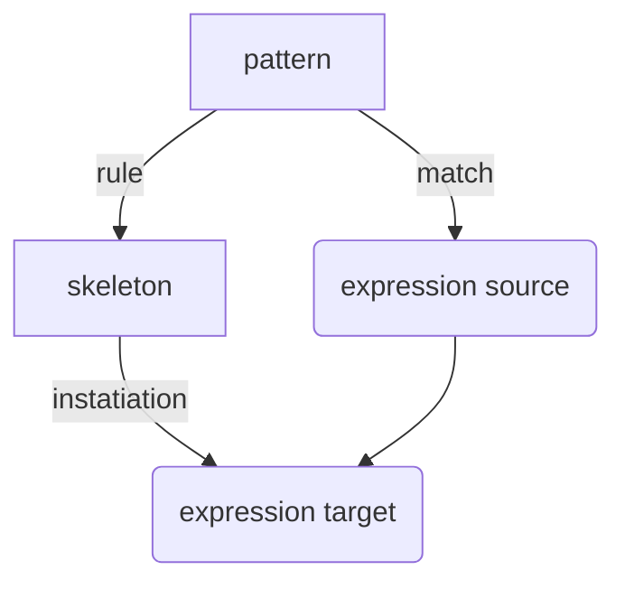

Source: 
Author: [[Gerald Sussman]]
Topics: [[SICP]] [[Programming MOC|Computer Science]]
Type: #talk
Date: 2022-01-03

## Lecture 2A
[source](https://ocw.mit.edu/courses/electrical-engineering-and-computer-science/6-001-structure-and-interpretation-of-computer-programs-spring-2005/video-lectures/2a-higher-order-procedures)

## Lecture 2B - Compound Data
[source](https://ocw.mit.edu/courses/electrical-engineering-and-computer-science/6-001-structure-and-interpretation-of-computer-programs-spring-2005/video-lectures/2b-compound-data)

Just like procedures, we have primitive data, and compound data

Define a data structure as an interface, we can `make-rat` to build one, we can call `numer` and `denom` on it, and do arithmetic with `+rat`, `-rat`, `*rat`, and `/rat`

`make-rat` allows us to create a layer of abstraction above pair operstaions like `cons`, `car`, and `cdr`

**never make up your mind until you're forced to** - data abstraction is one way to do this

building `cons`, `car` and `cdr` out of procedures

procedures are objects

## Lecture 3A - Henderson Escher Example
[source](https://ocw.mit.edu/courses/electrical-engineering-and-computer-science/6-001-structure-and-interpretation-of-computer-programs-spring-2005/video-lectures/3a-henderson-escher-example)

[[LIST]] has a convention for representing a sequence as a chain of pairs

`(1 (2 (3 (4)))` == `(list 1 2 3 4`

`(car (list 1 2 3 4)) => 1`

definition of `map`

`for-each` vs `map`, `for-each` does not create a list

`tree-recursion` is not `map`

## Lecture 3B - Symbolic Differentation
[source](https://ocw.mit.edu/courses/electrical-engineering-and-computer-science/6-001-structure-and-interpretation-of-computer-programs-spring-2005/video-lectures/3b-symbolic-differentiation-quotation)

explains quotation

## Lecutre 4A: Pattern Matching and Rule-based Substitution
[ ] TODO: revisit this after finishing the logic portion of [[SICP - Ch 4#4 4 Logic Programming]]
[lecture 4A](https://ocw.mit.edu/courses/electrical-engineering-and-computer-science/6-001-structure-and-interpretation-of-computer-programs-spring-2005/video-lectures/4a-pattern-matching-and-rule-based-substitution)

A Pattern is matched against a source expression, and a target expression is produced

Making up a language to solve domain problems

 `?` are pattern variables for matching
`:` substituion objects, or skeleton evaluations

match takes pattern, expression, and a dictionary

`(match pat exp dict)`

As patterns are matched to expressions, we are simultaneously matching parts on the pattern tree to the expression tree

for the pattern `(+ (* x y) y)` and the expression `(+ (* 2 4) 4)`

## Lecture 5A - Assignment, State, and Side-Effects
[source](https://www.youtube.com/watch?v=dO1aqPBJCPg&list=PLE18841CABEA24090&index=9)
Covers [[SICP - Ch 3#3 1]],  [[SICP - Ch 3#3 2]]

- Assignment is special, in that it produces a moment in time
- Assignment updates the map of name-->value
- we can no longer use the *substituion model* ov evaluation
- *scope* 
- lamdas declare variables in bound variable list
	- creates a scope
- *environment*
- *free variables* are used but unbound
- *procedure object*
	- made of 2 parts
		- first part refers to code to be executed
		- second part is the environment
	- procedure is code + environment
- Procedure object is appled to a set of arguments by creating a *frame*
- What is an object?
	- How can we tell we have an object?
		- if you have two of someting, change one and see if the other changes
		- if one changes, they are objects
		- of both change, they aren't objects OR are the same object

## Lecture 5B - Computational Objects
[source](https://www.youtube.com/watch?v=yedzRWhi-9E&list=PLE18841CABEA24090&index=10)

Electrical systems: physicists' best objects

Inverter - returns opposite of input

wire - message accepting object
    - stateful object
	- set-my-signal: changes signal state
	- accepts action procedures
		- inform output connections
	- dispatch: 
	
[[Queues]]
