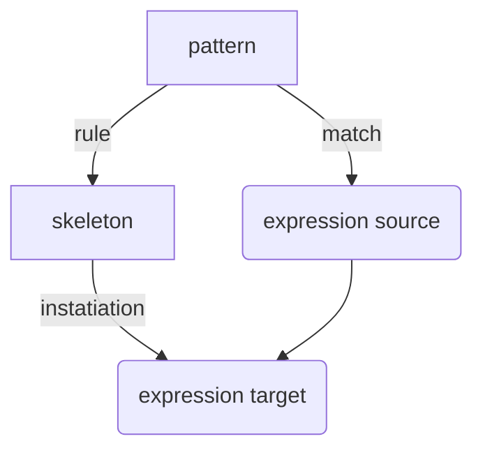

Source: 
Author: [[Gerald Sussman]]
Topics: [[SICP]] [[Programming MOC|Computer Science]]
Type: #talk
Date: 2022-01-03

## Lecture 2A
[source](https://ocw.mit.edu/courses/electrical-engineering-and-computer-science/6-001-structure-and-interpretation-of-computer-programs-spring-2005/video-lectures/2a-higher-order-procedures)

## Lecture 2B - Compound Data
[source](https://ocw.mit.edu/courses/electrical-engineering-and-computer-science/6-001-structure-and-interpretation-of-computer-programs-spring-2005/video-lectures/2b-compound-data)

Just like procedures, we have primitive data, and compound data

Define a data structure as an interface, we can `make-rat` to build one, we can call `numer` and `denom` on it, and do arithmetic with `+rat`, `-rat`, `*rat`, and `/rat`

`make-rat` allows us to create a layer of abstraction above pair operstaions like `cons`, `car`, and `cdr`

**never make up your mind until you're forced to** - data abstraction is one way to do this

building `cons`, `car` and `cdr` out of procedures

procedures are objects

## Lecture 3A - Henderson Escher Example
[source](https://ocw.mit.edu/courses/electrical-engineering-and-computer-science/6-001-structure-and-interpretation-of-computer-programs-spring-2005/video-lectures/3a-henderson-escher-example)

[[LIST]] has a convention for representing a sequence as a chain of pairs

`(1 (2 (3 (4)))` == `(list 1 2 3 4`

`(car (list 1 2 3 4)) => 1`

definition of `map`

`for-each` vs `map`, `for-each` does not create a list

`tree-recursion` is not `map`


## Lecture 3B - Symbolic Differentation
[source](https://ocw.mit.edu/courses/electrical-engineering-and-computer-science/6-001-structure-and-interpretation-of-computer-programs-spring-2005/video-lectures/3b-symbolic-differentiation-quotation)

explains quotation


## Lecutre 4A: Pattern Matching and Rule-based Substitution
[ ] TODO: revisit this after finishing the logic portion of [[SICP - Ch 4#4 4 Logic Programming]]
[lecture 4A](https://ocw.mit.edu/courses/electrical-engineering-and-computer-science/6-001-structure-and-interpretation-of-computer-programs-spring-2005/video-lectures/4a-pattern-matching-and-rule-based-substitution)

A Pattern is matched against a source expression, and a target expression is produced

Making up a language to solve domain problems



 `?` are pattern variables for matching
`:` substituion objects, or skeleton evaluations

match takes pattern, expression, and a dictionary

`(match pat exp dict)`

As patterns are matched to expressions, we are simultaneously matching parts on the pattern tree to the expression tree

for the pattern `(+ (* x y) y)` and the expression `(+ (* 2 4) 4)`

## Lecture 5A - Assignment, State, and Side-Effects
[source](https://www.youtube.com/watch?v=dO1aqPBJCPg&list=PLE18841CABEA24090&index=9)
Covers [[SICP - Ch 3#3 1]],  [[SICP - Ch 3#3 2]]

- Assignment is special, in that it produces a moment in time
- Assignment updates the map of name-->value
- we can no longer use the *substituion model* ov evaluation
- *scope* 
- lamdas declare variables in bound variable list
	- creates a scope
- *environment*
- *free variables* are used but unbound
- *procedure object*
	- made of 2 parts
		- first part refers to code to be executed
		- second part is the environment
	- procedure is code + environment
- Procedure object is appled to a set of arguments by creating a *frame*
- What is an object?
	- How can we tell we have an object?
		- if you have two of someting, change one and see if the other changes
		- if one changes, they are objects
		- of both change, they aren't objects OR are the same object

## Lecture 5B - Computational Objects
[source](https://www.youtube.com/watch?v=yedzRWhi-9E&list=PLE18841CABEA24090&index=10)

Electrical systems: physicists' best objects

Inverter - returns opposite of input

wire - message accepting object
    - stateful object
	- set-my-signal: changes signal state
	- accepts action procedures
		- inform output connections
	- dispatch: 
	
[[Queue]]s

## Lecture 6A - Streams
[source](https://www.youtube.com/watch?v=a2Qt9uxhNSM)
To avoid the mess we see with mutable state, what if we rethink how we model the problem
What if we modelled problems more like [[Signal Processing]] where each node in a network transforms an input signal into an output signal

We'll use _streams_ as a data structure to carry signals

```scheme
(cons-stream x y)
(head s)
(tail s)
(map-stream)
```

Stream processing establishes _conventional interfaces_ that allow us to glue things together, like `map` and `filter` and `accumulate`. This allows us to see the commonality between programs.

Similar to [[APL]]

Imaginge a stream of streams

```scheme
((1 2 3 ...), (2 3 4 ...), (5 6 7 ...))

;; flatten them
(define (flatten st-of-st)
  (accumulate append-streas
			  the-empty-stream
			  st-of-st))

(define (flatmap f s)
  (flatten (map f s)))

;; given N find all pairs of 0 < J < J <= N such that I + J is prime

(flatmap 
	(lambda (i)
		(map
		(lambda (j) (list i j))
		(enum-interval 1 (-1+ i))))
	(enum-interval 1 n))
```

We can create a `collect` syntactic sugar fn

```scheme
(define (prime-sum-pairs n)
    (collect
      (list i j (+ i j)))
```

8 queens problem, a classic [[backtracking]] problem

assume a `safe?` predicate

```scheme
(safe? <row> <column> <rest-positions>)
```

A naive solution to find a safe position is to walk the tree of possible positions on the board

**Tradeoffs of streams**
The thing that make imperative functions ugly is what makes them efficient, similar to the iterative vs recursive styles.

If implemented with lists, each step in the transformation would process _all_ of the data at each step 

## Lecture 8A - [[Logic Programming]]
[Lecture Video](https://www.youtube.com/watch?v=rCqMiPk1BJE&list=PLE18841CABEA24090&index=15)

*unification* - [[Unification Algorithm]] and the [[Resolution Principle]]

Because we have a gneral purpose idea of `eval` and `apply`, we can create another kind of language.

Most of computer science is "how to" knowledge, where math is "declarative". 

What if we could write programs by "specifying facts".

Given these facts:

```
SON-OF adam abel
SON-OF adam cain
```

Can we answer "who is cain the son-of" or "who are the sons of cain" or "what is the relationship between cain and abel"

We could define `GRANDSON-OF` thus:
```
IF (SON-OF ?x ?y) AND (SON-OF ?y ?z)
THEN
GRANDSON-OF ?x ?z
```

Procedural programming has inputs and outputs. Rules talk about *relations*

We can define a `merge` function that takes two lists as arguments such that 

```scheme
(= (merge '(1 2 3) '(4 5)) '(1 2 3 4 5))
Lecture```

But in a logic program, we could assert:
```
'(1 2 3) AND '(4 5) MERGE-TO-FORM '(1 2 3 4 5)
```

We could also ask what lists can merge to form the answer:
```
?x and ?y MERGE-TO-FORM '(1 2 3 4 5 6)
```

Relations don't have directionality

Use logic to *express* what is true, use logic to *check* what is true, use logic to *find out* what is true

We'll build a logic system that is similar to [Prolog]
